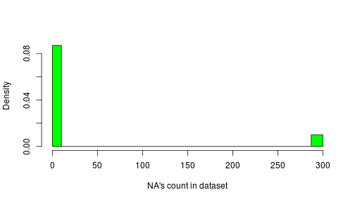
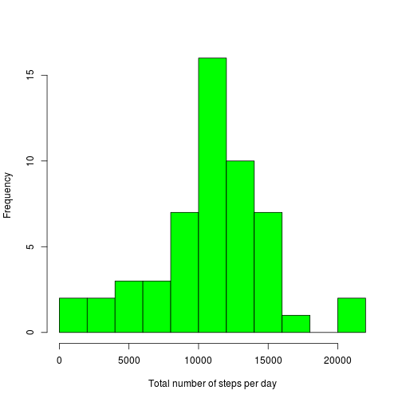
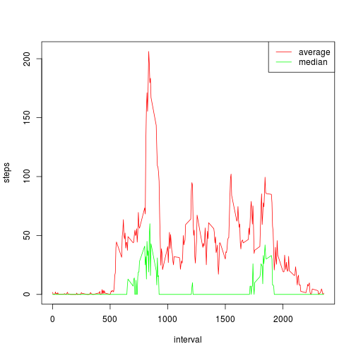
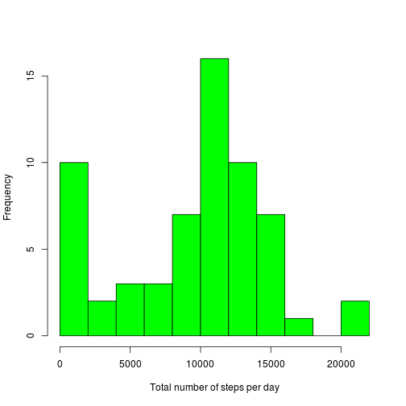
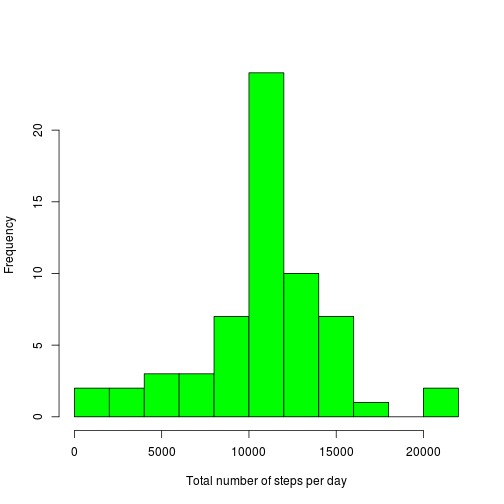
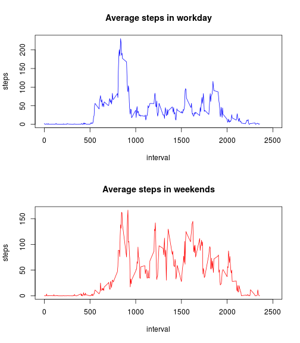

#Personal movement devices data analysis

## Introduction

It is now possible to collect a large amount of data about personal
movement using activity monitoring devices such as a
[Fitbit](http://www.fitbit.com), [Nike
Fuelband](http://www.nike.com/us/en_us/c/nikeplus-fuelband), or
[Jawbone Up](https://jawbone.com/up). These type of devices are part of
the "quantified self" movement -- a group of enthusiasts who take
measurements about themselves regularly to improve their health, to
find patterns in their behavior, or because they are tech geeks. But
these data remain under-utilized both because the raw data are hard to
obtain and there is a lack of statistical methods and software for
processing and interpreting the data.

This assignment makes use of data from a personal activity monitoring
device. This device collects data at 5 minute intervals through out the
day. The data consists of two months of data from an anonymous
individual collected during the months of October and November, 2012
and include the number of steps taken in 5 minute intervals each day.

## Data

The data for this assignment can be downloaded from the course web
site:

* Dataset: [Activity monitoring data](https://d396qusza40orc.cloudfront.net/repdata%2Fdata%2Factivity.zip) [52K]

The variables included in this dataset are:

* **steps**: Number of steps taking in a 5-minute interval (missing
    values are coded as `NA`)

* **date**: The date on which the measurement was taken in YYYY-MM-DD
    format

* **interval**: Identifier for the 5-minute interval in which
    measurement was taken


The dataset is stored in a comma-separated-value (CSV) file and there
are a total of 17,568 observations in this
dataset.

##Assignment
To complete this course assignment some analysis was performed and it will be described below.

Report was performed in R Markdown language in RStudio on 2015-12-20. R Base plotting system was used to make figures. Additional packages required to process R Markdown is only used from additional packages.

##Loading and processing the data
Let's begin.

Data is loaded by


```r
act <- read.csv('activity.csv')
```

Additonal preparation/transformation is not required at this time.


```r
summary(act)
```

```
##      steps                date          interval     
##  Min.   :  0.00   2012-10-01:  288   Min.   :   0.0  
##  1st Qu.:  0.00   2012-10-02:  288   1st Qu.: 588.8  
##  Median :  0.00   2012-10-03:  288   Median :1177.5  
##  Mean   : 37.38   2012-10-04:  288   Mean   :1177.5  
##  3rd Qu.: 12.00   2012-10-05:  288   3rd Qu.:1766.2  
##  Max.   :806.00   2012-10-06:  288   Max.   :2355.0  
##  NA's   :2304     (Other)   :15840
```

There are a lot of NA's in steps columns (~13% of all data). Every day is devided in 288 5 minutes intervals. There is a complete empty day (all 5 minute intervals are NA's values) possible device was off during the days. To illustrate this fact some statistic is present bellow:

```r
hist(
	sapply(
		split(act$steps[is.na(act$steps)], act$date[is.na(act$steps)]),
		length),
			xlab="NA's count in dataset", main=' ',
			breaks=c(0,10, 50, 287, 300) ,
			col='green')
```

 

```r
DaysCount <- length(unique(act$date))
NotNAValue <- sum(
	ifelse(sapply(
		split(act$steps[is.na(act$steps)], act$date[is.na(act$steps)]),
		length)
		== 0,
	1,
	0))
```
Therefore from total 61 days 53 does not contain NA's values

##What is mean total number of steps taken per day?

To better understand dataset (limits, variation etc.) Let's start our analysis from histogram of total number of steps taken each day. Remember that for adults normal is 10000 steps per day.

```r
hist(
	sapply(split(act$steps, act$date), sum),
	freq=T, breaks=15,
	main='', xlab = 'Total number of steps per day', col='green')
```

 

Also show mean and median values

```r
mean(sapply(split(act$steps, act$date), sum), na.rm=T)
```

```
## [1] 10766.19
```

```r
median(sapply(split(act$steps, act$date), sum), na.rm=T)
```

```
## [1] 10765
```

##What is the average daily activity pattern?
Continue analysis with averaging in time by 5 minutes intervals. The code bellow construct time series of averaged in 2 months (53 days) 5 minutes intervals steps count.
  First of all split initial dataset by 5 minutes intervals ...
 
 ```r
 steps5min <- split(act$steps, as.factor(act$interval))
 ```

... and plot average (in red) and median (in green)

```r
plot(
	names(sapply(steps5min, mean, na.rm=T)),
	sapply(steps5min, mean, na.rm=T),
	type='l', col='red',
	xlab='interval', ylab='steps', main='')
points(
	names(sapply(steps5min, mean, na.rm=T)),
	sapply(steps5min, median, na.rm=T), type='l', col='green')
legend('topright', lty=1, col=c('red', 'green'), legend=c('average', 'median'))
```

 

We observed big differance between median and average for intervals because 5 min is a small time interval and there are a lot of zero activity in small interval, but as we observed before by daily basis we have quite similar mean and median value. In father analysis we prefere use median value to replace NA's. 

To complete analysis of daily activities idendtify interval with maximum step count. First of all build vector with maximum values and get the maximum for maximums

```r
steps5min.max <- sapply(steps5min, max, na.rm=T)
steps5min.max.number <- max(steps5min.max)
steps5min.max.number
```

```
## [1] 806
```
After got number of maximum interval

```r
length(steps5min.max[steps5min.max == steps5min.max.number])
```

```
## [1] 1
```
And finally find the interval

```r
which.max(steps5min.max)
```

```
## 615 
##  76
```
Ohoho, 806 steps in 300 seconds very good result (or very short steps) for 615 interval (from 6:15am till 6:20am). The person is very active in the morning (or late night). Let's continue.  

##Imputing missing value
As mention before there are a lot of NA's values in dataset.

```r
NACount <- length(act$steps[is.na(act$steps)])
NACount
```

```
## [1] 2304
```

2304 is quite big number. Replace it by median values for correspondent intervals


```r
act.nna.median <- act
steps5min.median <- sapply(steps5min, median, na.rm=T)
act.nna.median$steps[is.na(act$steps)] = 
	steps5min.median[as.character(act$interval[is.na(act$steps)])]
```

Let's look on dayly distribution and observed how average and median changed for new dataset

```r
hist(sapply(split(act.nna.median$steps, act.nna.median$date), sum),
	breaks=15, freq=T,
	main='', xlab = 'Total number of steps per day', col='green')
```

 

```r
mean(sapply(split(act.nna.median$steps, act.nna.median$date), sum))
```

```
## [1] 9503.869
```

```r
median(sapply(split(act.nna.median$steps, act.nna.median$date), sum))
```

```
## [1] 10395
```

Do the same for mean

```r
act.nna.mean <- act
steps5min.mean <- sapply(steps5min, mean, na.rm=T)
act.nna.mean$steps[is.na(act$steps)] =
	steps5min.mean[as.character(act$interval[is.na(act$steps)])]
hist(sapply(split(act.nna.mean$steps, act.nna.mean$date), sum),
	breaks=15, freq=T,
	main='', xlab = 'Total number of steps per day', col='green')
```

 

```r
mean(sapply(split(act.nna.mean$steps, act.nna.mean$date), sum))
```

```
## [1] 10766.19
```

```r
median(sapply(split(act.nna.mean$steps, act.nna.mean$date), sum))
```

```
## [1] 10766.19
```

Statistic for mean looks closer to initial distribution this is why we use this method in the last piece of the analysis.

##Are there differences in activity patterns between weekdays and weekends?
In the end let's see how activity differ in working and weekends days. First extended our dataset by weekdays

```r
act.extended <- act.nna.mean
act.extended$weekdays <- weekdays(as.Date(act.nna.mean$date))
```
Add factor to indicate weekdays and weekends:

```r
act.extended$dayType <- factor(
	ifelse(act.extended$weekdays %in% c('Sunday', 'Saturday'),
		'weekend',
		'weekday'))
act.extended[sample(nrow(act), size=20),]
```

```
##           steps       date interval  weekdays dayType
## 6735   90.00000 2012-10-24      910 Wednesday weekday
## 13034   0.00000 2012-11-15      605  Thursday weekday
## 9967   41.84906 2012-11-04     1430    Sunday weekend
## 11992   0.00000 2012-11-11     1515    Sunday weekend
## 5712  529.00000 2012-10-20     1955  Saturday weekend
## 7415    0.00000 2012-10-26     1750    Friday weekday
## 3497    0.00000 2012-10-13      320  Saturday weekend
## 14023 746.00000 2012-11-18     1630    Sunday weekend
## 11474  19.01887 2012-11-09     2005    Friday weekday
## 4967    0.00000 2012-10-18      550  Thursday weekday
## 7069    0.00000 2012-10-25     1300  Thursday weekday
## 6494   40.00000 2012-10-23     1305   Tuesday weekday
## 15182  71.00000 2012-11-22     1705  Thursday weekday
## 7364   80.00000 2012-10-26     1335    Friday weekday
## 11902  14.00000 2012-11-11      745    Sunday weekend
## 14687   0.00000 2012-11-20     2350   Tuesday weekday
## 1516   36.00000 2012-10-06      615  Saturday weekend
## 8106    0.00000 2012-10-29      325    Monday weekday
## 924     0.00000 2012-10-04      455  Thursday weekday
## 7965    0.00000 2012-10-28     1540    Sunday weekend
```
Make 5 minutes intervals matrix, create weekend flag and build two plots as required:

```r
s5m.ext <- aggregate(steps ~ interval+dayType, act.extended, mean)
wEnd <- s5m.ext$dayType == 'weekend'
par(mfrow=c(2,1))
plot(s5m.ext$interval[!wEnd], s5m.ext$steps[!wEnd],
	type="l", xlim=c(0, 2500), xlab='interval', ylab='steps', col='blue',
	main='Average steps in workday')
plot(s5m.ext$interval[wEnd], s5m.ext$steps[wEnd],
	type="l", xlim=c(0, 2500), xlab='interval', ylab='steps', col='red',
	main='Average steps in weekends')
```

 

Ok. As expected movind starting a little bit earlier in working days, but less intensive during the day.

##End Note
This is the end. It is time to submit. Thank you for your attention. Good luck! Take care, do sport!
